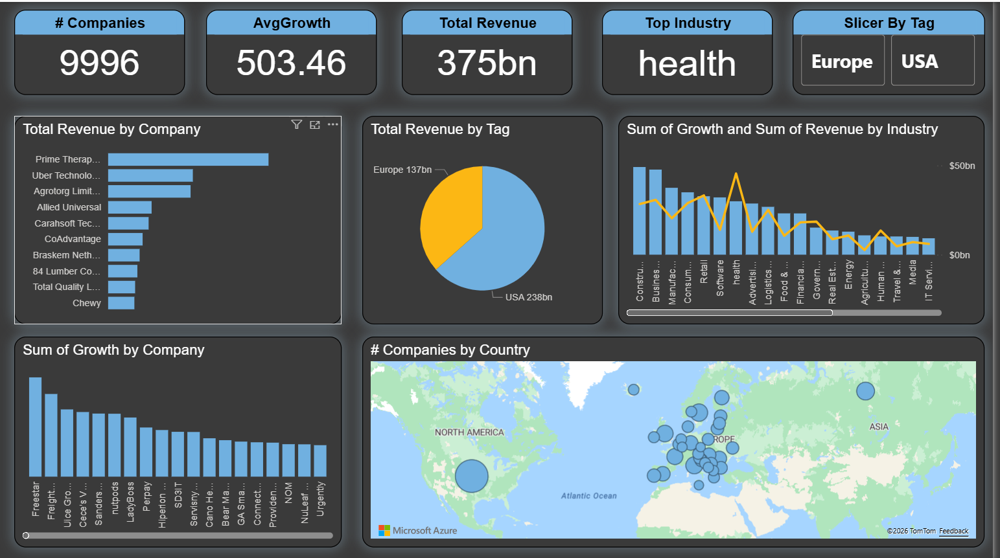

# Global Company Performance Dashboard (USA & Europe)

  

## 📌 Project Overview
An interactive Power BI dashboard designed to analyze and compare company performance across the **USA and Europe**. The project focuses on key financial metrics such as revenue growth, industry trends, and geographical distribution to provide a holistic view of the market landscape.

## 🛠️ Technical Workflow

### 1. Data Integration & ETL (Power Query)
* **Data Source:** Integrated multi-format datasets including **Excel (.xlsx)** and **Text/CSV (.csv)** files containing regional company data.
* **Data Transformation:** * Performed **Data Appending** to merge the Excel and CSV datasets into a unified master table.
    * Standardized data types and column structures across different file formats to ensure seamless integration.
    * Cleaned and handled missing values to ensure accurate growth and revenue reporting.
    * Created custom columns and tags to enable regional slicing (USA vs. Europe).

### 2. Data Modeling
* Built a streamlined data model to handle large-scale information (nearly 10,000 companies).
* Optimized the schema to support fast filtering across industries, countries, and tags.

### 3. Advanced Visualization & Analytics
* **KPI Scorecard:** Real-time tracking of Total Companies (**9,996**), Average Growth (**503.46**), and Total Revenue (**$375bn**).
* **Industry Insights:** Identified "Health" as the top-performing industry.
* **Dual-Axis Charts:** Combined Sum of Growth and Revenue by Industry to visualize the correlation between scale and expansion.
* **Geospatial Analysis:** Integrated a Map visual to show company density across North America and Europe.

## 📊 Key Insights
* **Revenue Leaders:** Prime Therapeutics and Uber Technologies lead the revenue charts.
* **Regional Comparison:** The USA accounts for **$238bn** of the total revenue, compared to **$137bn** from the European market.
* **Growth Trends:** High growth density is observed in the Construction and Business Services sectors.

## 🚀 Tools & Technologies
* **BI Tool:** Microsoft Power BI
* **Data Processing:** Power Query (Excel & CSV Integration)
* **Visuals:** Advanced Mapping, Combo Charts, and Slicers.
* **Theme:** Custom Dark Mode UI for enhanced readability.
